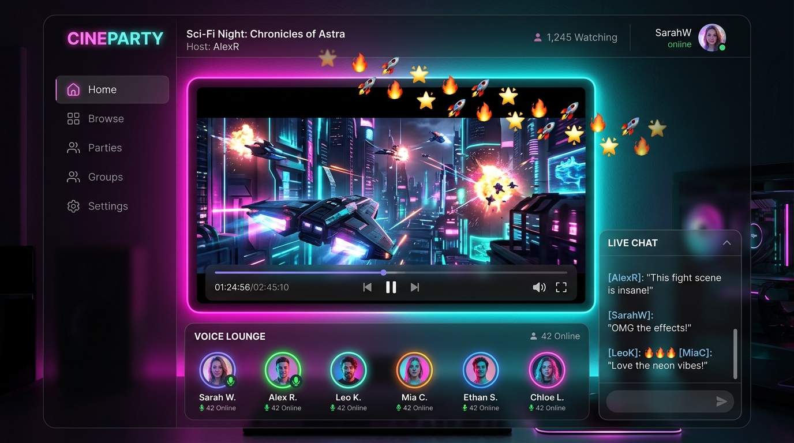
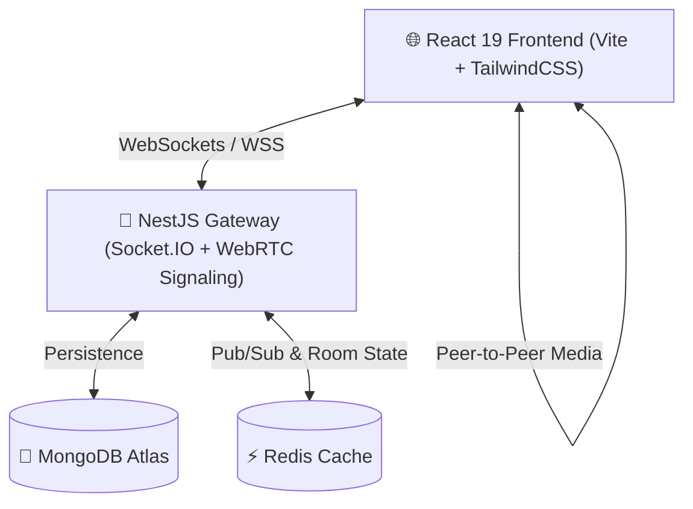

<div align="center">

  <br />

  

  <h1 align="center"><b>RATRI — Real-Time Watch & Spatial Talk Platform</b></h1>

  <p align="center">
    <b>Synchronized Media Playback • WebRTC Voice & Video • Spatial Music Lounge • Screen Sharing</b>
  </p>

  <p align="center">
    <a href="https://ratri-silk.vercel.app" target="_blank">
      
    </a>
    <a href="https://ratri.onrender.com/v1" target="_blank">
      
    </a>
    
  </p>

  <br />

  

  <br />
  <br />

</div>

---

## 🌟 Overview

**RATRI** (night / midnight lounge) is a state-of-the-art, real-time social platform built for seamless synchronized video watching, low-latency WebRTC voice and video calls, spatial music listening, and high-definition screen sharing. 

Designed with a **guest-first philosophy**, users can create or join watch parties in under 2 seconds without tedious sign-up forms or downloads.

### ⚡ Key Features

- 📺 **Synchronized Watch Party**: Sub-second video playback synchronization powered by WebSockets (`Socket.IO`). Host play/pause/seek events mirror instantly across all connected peers.
- 🎙️ **WebRTC Voice & Video**: Crystal-clear, peer-to-peer mesh media streams with adaptive bitrate control and active speaker indicators.
- 🖥️ **Browser Screen Sharing**: Share high-frame-rate desktop, window, or tab streams directly inside any room without extra extensions.
- 🎧 **Music & Chill Lounges**: Spatial audio listening rooms with shared queue management and interactive sound effects.
- 🛡️ **Enterprise Security & Isolation**: Strict room boundary isolation, JWT handshake validation, RBAC host controls, rate limiting, and Helmet CSP headers.
- 🎨 **Adaptive Themes**: Seamless dark & light mode support with high-contrast accessibility.

---

## 🛠️ Architecture & Tech Stack

RATRI is organized as a high-performance **pnpm monorepo**:



### 💻 Technologies Used

| Layer | Stack |
| :--- | :--- |
| **Frontend** | React 19, Vite, TypeScript, TailwindCSS, Lucide Icons, Framer Motion |
| **Backend** | NestJS 10, Socket.IO, WebRTC Signaling, RxJS, Class-Validator |
| **Database & Cache** | MongoDB Atlas (Mongoose), Redis |
| **DevOps & Hosting** | Vercel (Frontend), Render Docker Container (Backend) |

---

## 📁 Repository Structure

```text
Ratri/
├── apps/
│   ├── api/                  # NestJS WebSockets & REST API
│   │   ├── src/
│   │   │   ├── auth/         # JWT Authentication & Handshakes
│   │   │   ├── rooms/        # Room State Gateway & WebRTC Signals
│   │   │   └── common/       # Rate Limiters & Security Filters
│   │   └── Dockerfile        # Production Docker configuration
│   └── web/                  # React Vite Frontend Application
│       ├── public/           # Favicons, SEO Sitemaps & Static Assets
│       └── src/
│           ├── components/   # UI Components & Header
│           ├── routes/       # Watch Party, Music Lounge & Room Routes
│           └── services/     # WebSockets & WebRTC Peer Connections
├── docker-compose.prod.yml   # Multi-container Production Orchestration
├── pnpm-workspace.yaml       # Monorepo Workspace Definitions
└── README.md
```

---

## 🚀 Getting Started Locally

Follow these steps to run RATRI on your machine:

### 1. Prerequisites
- **Node.js**: `v18.x` or `v20.x`
- **pnpm**: `v8.x` or `v9.x` (`npm i -g pnpm`)
- **MongoDB**: Local instance or MongoDB Atlas Connection String

### 2. Installation
Clone the repository and install dependencies:
```bash
git clone https://github.com/Akashcodev001/Ratri.git
cd Ratri
pnpm install
```

### 3. Environment Setup
Copy `.env.example` to `.env` inside `apps/api/`:
```bash
# apps/api/.env
PORT=3000
NODE_ENV=development
JWT_SIGNING_KEY=your-32-character-secret-jwt-key
MONGODB_URI=mongodb://localhost:27017/ratri
CLIENT_ORIGIN=http://localhost:5173
```

### 4. Run Development Servers
Start both backend and frontend concurrently:
```bash
pnpm run dev
```

- **Frontend**: Available at `http://localhost:5173`
- **Backend API**: Available at `http://localhost:3000/v1`

---

## 🌐 Production Deployment

### Backend (Render Docker Service)
1. Deploy `apps/api/Dockerfile` on Render as a **Web Service**.
2. Set Environment Variables (`NODE_ENV=production`, `PORT=3000`, `JWT_SIGNING_KEY`, `MONGODB_URI`, `CLIENT_ORIGIN`).

### Frontend (Vercel)
1. Import repository on Vercel with Root Directory set to `apps/web`.
2. Set Framework Preset to **Vite**.
3. Add Environment Variables:
   - `VITE_API_URL` = `https://<your-render-backend-url>/v1`
   - `VITE_SOCKET_URL` = `https://<your-render-backend-url>`

---

## 🛡️ Security & Quality Standards

- 🔒 **Handshake JWT Auth**: Prevents unauthorized socket connections.
- 🛡️ **Room Boundaries**: Signals strictly blocked across different room IDs.
- ⚡ **Rate-Limiting**: `@nestjs/throttler` limits spam requests.
- 🌐 **Content Security Policy**: Hardened Helmet security headers.

---

## 👤 Author

Developed with ❤️ by **Akash ([Akashcodev001](https://github.com/Akashcodev001))**

---

<div align="center">
  <sub>Built with React, NestJS, WebRTC and Socket.IO. Star ⭐ the repository if you find it helpful!</sub>
</div>
